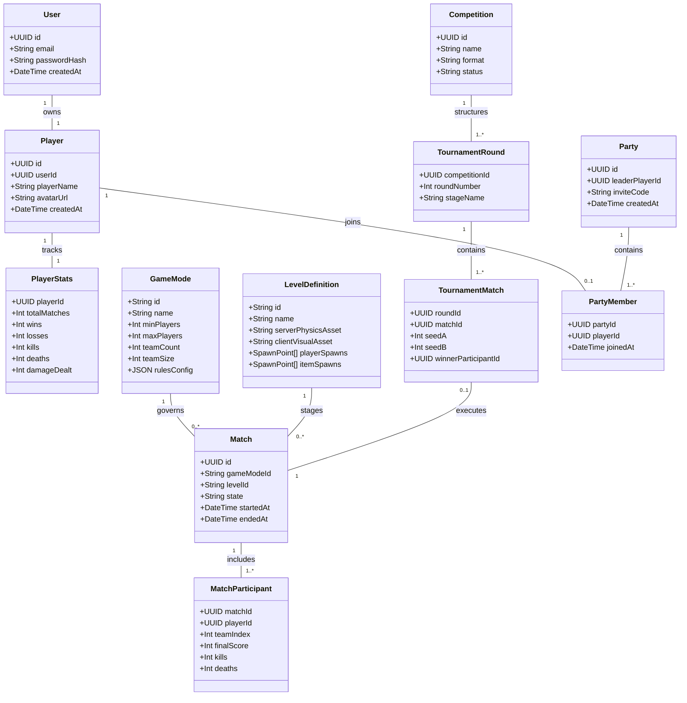

# Thunder Dome Fighter — Master Game Roadmap & Architecture Specification

> **Document Classification**: Core Project Source of Truth  
> **Target Audience**: Developers, Software Architects, and Antigravity AI Agents  
> **Status**: Active Living Roadmap  

---

# Project Status

| Field | Value |
| :--- | :--- |
| **Current Phase** | **Phase 4 — Authoritative Player Entity & Humanoid Movement** |
| **Current Step** | **Step 4.1 — Replace vehicle box physics body with upright humanoid capsule collider** |
| **Last Completed Step** | **Step 3.6 — Implement global ErrorDialog and in-game HUD overlay** |
| **Next Step** | **Step 4.1 — Implement upright character capsule kinematics and 8-way movement model** |
| **Overall Status** | **Phase 3 (Application Shell & UI Navigation) 100% complete; moving to Phase 4.** |
| **Last Updated** | **2026-10-03** |

---

## Status Legend

| Indicator | Meaning | Description |
| :---: | :--- | :--- |
| `[ ]` | **Not Started** | Work has been scheduled and specified but no code has been written. |
| `[~]` | **In Progress** | Currently under active development or iterative refinement. |
| `[x]` | **Completed** | Fully implemented, verified against completion criteria, and integrated. |
| `[!]` | **Blocked** | Impeded by technical impediments, dependency gaps, or awaiting architectural consensus. |

---

# Architecture Glossary

This glossary defines standard terminology used across Thunder Dome Fighter to maintain conceptual clarity and prevent domain drift.

| Term | Simple Definition | Context & Invariants |
| :--- | :--- | :--- |
| **Authoritative Server** | The central server instance that holds complete physical and logical truth. | The client sends user intentions/inputs; the server validates them, simulates physics, detects collisions/hits, updates scores, and broadcasts state. The client *never* dictates game outcomes. |
| **Client Prediction** | Local simulation of physical movements immediately upon receiving user input. | Runs at fixed 30 Hz locally using client-side Havok, ensuring zero perceived input latency for the local player while awaiting authoritative server confirmations. |
| **Reconciliation** | The algorithmic process where the client verifies its past predictions against authoritative snapshots. | If local predicted state differs from server state beyond epsilon thresholds, the client rolls back physics to the authoritative baseline, flushes acknowledged inputs, replays unacknowledged inputs, and decays the visual offset smoothly. |
| **Remote Interpolation** | Smooth presentation of other players without executing physics on their behalf. | Remote entities consume historical authoritative snapshots buffered behind an adaptive render clock (target delay ~100ms) using Cubic Hermite Splines for position and Slerp for rotation. |
| **User** | The authentication and credential identity record. | Represents an account (email, hashed password, security tokens, account status). Completely decoupled from in-game persona. |
| **Player** | The in-game human persona and persistent player identity. | Stores the player name, avatar URL, lifetime stats, unlocked cosmetics, and configuration. Linked to a User via foreign key. |
| **Session** | An active authenticated connection or game room token. | Ephemeral record tying a client connection to a User and Player. |
| **Match** | A single instance of active gameplay with a defined beginning, progression, and conclusion. | Contains participants, teams, a selected level, runtime stats, and a match state machine. |
| **Room** | A Colyseus runtime container managing one active Match. | Hosts a dedicated headless Babylon.js scene, an isolated Havok physics world, and a 30 Hz simulation loop. Disposed cleanly upon match finalization. |
| **Game Mode** | A declarative configuration object defining the rules of a Match. | Specifies min/max players, team structure, scoring limits, round durations, respawn mechanics, and allowed weapon pools. |
| **Match Participant** | The runtime link between a Player and an active Match. | Tracks live health, assigned spawn slot, match team, live inputs, and temporary match progression modifiers. |
| **Match Team** | A logical grouping of Match Participants within a team-based Match. | Aggregates team score, shared objectives, and team spawn allocation. |
| **Competition / Tournament**| A higher-level competitive structure comprising multiple sequential or parallel Matches. | Completely decoupled from match simulation. Coordinates stages, rounds, brackets, and team/player progression across matches. |
| **Tournament Round / Match**| A structured node within a tournament bracket referencing a specific Match. | Tracks seeds, match assignments, advancing winners, and elimination criteria. |
| **Persistent Player Stats** | Permanent, lifetime statistics stored in the database. | Matches played, lifetime wins, lifetime kills, deaths, damage dealt, favorite weapons. Only updated via validated match finalization. |
| **Match Stats** | Live, volatile performance metrics accumulated during a single Match. | Kills, deaths, assists, damage dealt/taken, current kill streak, weapon hits/misses. Held strictly in server memory during gameplay. |
| **Match Modifier** | Temporary in-game attribute adjustments earned during a single Match. | Kill-streak bonuses (e.g., +5% movement speed, +3% force, altered jump impulse). Exists *strictly* inside the runtime match and vanishes on match end. |
| **Level Definition** | The declarative metadata and asset specification for an arena. | Defines level ID, name, server collision mesh/hull, client high-detail visual GLB, player spawns, weapon spawns, and boundary volumes. |
| **GameItem** | A generic catalog entity representing an interactable or equipable item. | Includes weapons, powerups, tools, or consumable pickups. Categorized to avoid hardcoded database columns. |
| **Action Mapping** | Decoupling physical input hardware from gameplay intentions. | Hardware events (keys, mouse buttons, gamepad axes) map to discrete actions (`MOVE_FORWARD`, `PRIMARY_ATTACK`, `JUMP`), which are bundled into sequenced input commands. |

---

# Current Project Assessment

*Based on direct inspection of the codebase on 2026-09-27.*

```
thunder-dome-fighter/
├── server/
│   ├── GameRoom.ts          # Colyseus Room implementation (authoritative room lifecycle)
│   ├── GameState.ts         # Colyseus Schema (serverTick, players map)
│   ├── SimulationWorld.ts   # Headless Babylon NullEngine + Havok WASM physics world
│   ├── colyseus.ts          # Server entry point (WebSocket transport, room registration)
│   └── server.ts            # Standalone headless Babylon+Havok test sandbox
├── shared/
│   ├── PlayerConfig.ts      # Backwards-compatibility re-export of player config
│   ├── player/
│   │   ├── PlayerConfig.ts  # Shared physics constants, tuning, and input interfaces
│   │   └── PlayerPhysicsMath.ts # Deterministic force/torque calculation routines
│   └── networking/
│       ├── PredictionMath.ts    # Euclidean distance, quaternion angular difference, history frame
│       ├── ReconciliationMath.ts# Epsilon tolerance evaluation & exponential visual error decay
│       └── InterpolationMath.ts # Monotonic render tick, adaptive time scale, Hermite spline
└── src/
    ├── App.tsx              # React UI shell with header overlay
    ├── components/
    │   ├── BabylonCanvas.tsx# Babylon scene, camera, lights, local mesh, prediction/interpolation loops
    │   ├── ConnectToColyseus.tsx # Basic connection toggle button (hardcoded endpoint)
    │   ├── LocalPlayerPrediction.ts # 30 Hz Havok prediction, history, rollback/replay, visual decay
    │   └── RemotePlayerInterpolation.ts # Snapshot history, time dilation, Hermite spline rendering
    └── store/
        └── useAppStore.ts   # Minimal Zustand store (title, isSceneReady, room)
```

### 1. What Currently Works
1. **Headless Babylon.js + Havok WASM Physics Server**:
   - `server/SimulationWorld.ts` successfully initializes `@babylonjs/havok` WASM in Node.js via `fs.readFile` and links it to `@babylonjs/core` via `NullEngine` and `HavokPlugin`.
   - Physics runs on a manual fixed-step accumulator at 30 Hz (`PHYSICS_DT_MS = 33.33ms`) decoupled from Node.js event-loop jitter via a high-resolution scheduler (`setInterval` at 16.6ms).
2. **Colyseus Authoritative State Synchronization**:
   - `server/GameRoom.ts` and `server/GameState.ts` synchronize server tick and entity transforms (x, y, z, rx, ry, rz, rw, vx, vy, vz, avx, avy, avz, lastProcessedInputSequence) using `@colyseus/schema` at 30 Hz patch rate.
   - Client identity is strictly bound to `client.sessionId`; arbitrary client-supplied IDs are rejected.
3. **Deterministic Shared Math Modules**:
   - `shared/player/PlayerPhysicsMath.ts` and `shared/networking/` provide pure TypeScript math routines free of DOM, React, or Colyseus dependencies, ensuring parity between server and client.
4. **Client-Side Prediction & Epsilon Reconciliation**:
   - `src/components/LocalPlayerPrediction.ts` runs an identical local Havok physics body at 30 Hz.
   - Evaluates prediction error against authoritative snapshots using strict tolerances (position: 0.02m, rotation: 0.03 rad, velocity: 0.1 m/s).
   - Only triggers rollback/replay when true misprediction occurs. Discrepancies are visually absorbed via exponential error-offset decay (100ms time constant) rather than abrupt snaps.
5. **Remote Player Interpolation with Drift Correction**:
   - `src/components/RemotePlayerInterpolation.ts` buffers authoritative snapshots and renders remote entities along a monotonic render clock (target delay 3 ticks = 100ms) using Cubic Hermite Splines for velocity-aware position curves and Quaternion Slerp for rotation, modulated by adaptive time dilation (1.03x speedup / 0.97x slowdown).
6. **Input Sequencing & Bounded Queue**:
   - Inputs carry strictly monotonic sequence numbers. The server validates, clamps, and buffers inputs with a priming target (2 ticks) to absorb arrival jitter without timeline corruption.

### 2. What Partially Works / Is Transitional
1. **Vehicular Physics Legacy**:
   - Although files were renamed from `vehicle` to `player` in Refactor 001, the mathematical models in `PlayerConfig.ts` and `PlayerPhysicsMath.ts` still calculate vehicle dynamics (`throttle`, `steering`, `brake`, forward force along orientation, angular torque around Y-axis).
   - The collision geometry is currently an elongated box (`1.8m x 1.5m x 4.5m`) rather than an upright humanoid character capsule (`radius ~0.4m, height ~1.8m`).
2. **Primitive Visual Representation**:
   - Both local and remote players are represented by colored box meshes. No GLB character models, materials, skeletal rigs, or animation groups are connected.
3. **Hardcoded Networking & Static Scene**:
   - `src/components/ConnectToColyseus.tsx` has a hardcoded IP (`http://192.168.0.28:2567`) and joins a single hardcoded room name (`"game"`).
   - The arena environment is a hardcoded static box floor (`50m x 0.1m x 50m`).

### 3. What Appears Experimental / Temporary
1. **`server/server.ts`**:
   - Standalone exploratory script that creates a NullEngine instance, drops a dynamic box onto a floor, and prints coordinates to console. Useful as a headless Havok verification harness, but not connected to Colyseus or client architecture.
2. **Minimal Zustand Store**:
   - `src/store/useAppStore.ts` holds only `title`, `isSceneReady`, and `room`. Lacks authentication, match state, user profile, settings, and UI navigation state.

### 4. Important Architecture to Preserve
- **Authoritative Server Model**: Server owns all physical state, outcomes, and rules. Client never reports hit validity or coordinate truth.
- **Fixed 30 Hz Physics Tick Rate**: Identical physics timestep (`33.33ms`) on both server and client prediction worlds.
- **Dual Timeline Input Sequencing**: Separate tracking of monotonic input sequence IDs and authoritative simulation ticks.
- **Epsilon Reconciliation with Visual Error Decay**: Prevents micro-stutters during normal play by skipping replays within tolerances, and smoothly absorbing genuine corrections.
- **Hermite Spline Remote Interpolation**: Preserves velocity tangents for smooth remote motion without visual jitter.
- **Input Sanitization & Clamping**: Strict server-side verification before passing inputs to physics.

### 5. What Requires Restructuring Later
- **Input Model**: Replace vehicle controls (`throttle`, `steering`, `brake`) with an 8-way directional action system, look direction, jump impulse, and attack triggers.
- **Character Physics**: Transition dynamic box bodies to upright capsule colliders with character controller kinematics and grounded checks.
- **Generic Room & Mode Configuration**: Decouple `GameRoom` from hardcoded match parameters into a dynamic room supporting configurable `GameModeDefinition` and `LevelDefinition`.
- **Database & Persistence Layer**: Introduce database persistence (PostgreSQL + Prisma/Drizzle) for accounts, profiles, and match results.
- **UI Shell**: Replace minimal connection button with a full React UI shell (Main Menu, Play Menu, Lobbies, HUD, Settings, Results).

---

# Generic Domain Architecture

To ensure the core platform remains extensible and not permanently tied to a single fighting game mechanic, all core systems must use genre-agnostic domain concepts.



### Prohibited Concepts vs. Preferred Concepts

| Prohibited Domain Concept | Preferred Generic Concept | Architectural Rationale |
| :--- | :--- | :--- |
| `Fighter` / `FightUser` | `User` (Auth) & `Player` (In-Game) | Decouples account credentials from in-game persona; reusable for racing, sports, or party games. |
| `FightingMatch` / `PunchMatch` | `Match` | A match is simply a timed session governed by a `GameMode` within a `Level`. |
| `CombatAccount` | `Player` & `PlayerStats` | Lifetime statistics apply across any competitive mode. |
| `FighterLoadout` | `PlayerLoadout` & `GameItem` | Items may be melee weapons, firearms, vehicle parts, or tools. |
| `FightArena` | `LevelDefinition` | Arenas, tracks, open arenas, and courses are all generic levels. |
| `FightTournament` | `Competition` / `Tournament` | Competition brackets execute standard matches regardless of game rules. |

Fighting-specific mechanics exist strictly at the gameplay component layer:
- `CombatSystem` (hitbox queries, attack execution, hurtbox damage calculation)
- `DamageSystem` (health reduction, stagger, armor mitigation, knockback impulses)
- `WeaponSystem` (weapon equipping, attack speeds, ranges, swing arcs, durability/ammo)

---

# Server Authoritative Architecture & Invariants

The authoritative server is the single source of truth. Every gameplay phase must maintain these architectural invariants:

1. **Client Never Dictates Outcomes**:
   - The client never sends: `"I hit player B"`, `"I killed player B"`, `"I have 100 health"`, `"My position is (X, Y, Z)"`, `"I picked up weapon X"`, or `"I won"`.
   - The client sends intentions only: `MOVE_DIR(x, z)`, `LOOK_ROTATION(yaw)`, `JUMP()`, `ATTACK(type)`.
2. **Server Validates Every Intention**:
   - Movement: Server advances physics with clamped input vectors.
   - Attack: Server verifies cooldown, current player state (not stunned or dead), and spawns authoritative hitbox volumes.
   - Hit Detection: Server evaluates geometric intersection between attacker hitbox and defender hurtbox in the authoritative Havok world.
   - Damage & Death: Server deducts health, computes knockback velocity, checks for death condition, increments attacker's match kills, applies temporary match modifiers, and broadcasts events.
3. **Decoupled Render & Physics Clocks**:
   - Authoritative physics steps at fixed 30 Hz (`PHYSICS_DT_MS = 33.33ms`).
   - Server network state patches are dispatched at 30 Hz (`patchRate = 1000 / 30`).
   - Client displays at native hardware refresh rates (60 Hz, 120 Hz, 144+ Hz) via interpolation and smoothing.
4. **Blender Animations Never Determine Physics**:
   - Animations inside character GLBs (punches, kicks, jumps, deaths) are purely visual representations triggered by authoritative server state flags.
   - The duration of an animation clip does not determine the damage window; explicit server-side state timing windows govern hit active frames.

---

# Data Classification: Persistent vs. Runtime Match State

```mermaid
graph TD
    subgraph Persistent Storage (PostgreSQL Database)
        U[User Account]
        P[Player Identity]
        PS[Player Lifetime Stats]
        CO[Cosmetic Ownership]
        MR[Finalized Match Records]
        TR[Tournament History]
    end

    subgraph Colyseus Authoritative Room Memory (RAM)
        MPS[MatchPlayerState]
        MM[Match Modifiers / Temporary Upgrades]
        HP[Live Health / Armor]
        TRK[Active Transforms & Velocities]
        KST[Live Kill Streaks]
        MS[Live Match Scoreboard]
    end

    U --> P
    P --> PS
    P --> CO
    MR --> PS

    MPS -. Validated at Match Finalization .-> MR
    MM -. Discarded upon Room Disposal .-> X((Destroyed))
    HP -. Discarded upon Room Disposal .-> X
```

### Data Categorization Matrix

| Data Item | Classification | Storage Location | Lifetime |
| :--- | :--- | :--- | :--- |
| **Email, Password Hash, Tokens** | Persistent | Database (`users`) | Permanent account lifetime |
| **Player Name, Avatar, Creation Date** | Persistent | Database (`players`) | Permanent account lifetime |
| **Lifetime Kills, Deaths, Wins, Losses** | Persistent | Database (`player_stats`) | Permanent, updated at match end |
| **Item / Weapon Lifetime Stats** | Persistent | Database (`player_item_stats`) | Permanent, updated at match end |
| **Tournament Results & Champion Title** | Persistent | Database (`tournament_results`) | Permanent historical record |
| **Current World Position & Velocity** | Runtime | Server Memory (`SimulationWorld`) | Reset each match / spawn |
| **Current Health & Armor** | Runtime | Server Memory (`MatchPlayerState`) | Reset each life / match |
| **Temporary Kill Modifiers (Speed, Force)**| Runtime | Server Memory (`MatchPlayerState`) | **Match only (erased on match end)** |
| **Current Kill Streak** | Runtime | Server Memory (`MatchPlayerState`) | Current life or match |
| **Live Match Score & Scoreboard** | Runtime | Server Memory (`GameRoom`) | Current match only |
| **Equipped Weapon in Match** | Runtime | Server Memory (`SimulationWorld`) | Match life only |

---

# Phased Development Roadmap

The project is structured into **31 sequential, trackable phases (Phase 0 to Phase 30)** designed around progressive playable vertical slices.

---

### Phase 0 — Current Repository Assessment & Architectural Baseline Audit

**Status:** Completed `[x]`  
**Goal:** Thoroughly inspect existing code, verify current capabilities, and record baseline invariants.  
**Dependencies:** None.  

#### Steps
- [x] 0.1 Inspect project structure, scripts, and runtime environment.
- [x] 0.2 Verify headless Babylon.js (`NullEngine`) and `@babylonjs/havok` WASM initialization in Node.js.
- [x] 0.3 Verify Colyseus 0.18 room lifecycle, schema definition, and network patch synchronization.
- [x] 0.4 Audit shared mathematical modules (`PlayerPhysicsMath`, `PredictionMath`, `ReconciliationMath`, `InterpolationMath`).
- [x] 0.5 Document architectural invariants, legacy vehicular artifacts, and create initial decision log.

#### Completion Criteria
- Complete repository assessment documented in `GAME-ROADMAP.md`.
- No source code or configuration files modified during assessment.

#### Verification
- All assertions verified by direct inspection of code paths in `server/`, `shared/`, `src/`, and `package.json`.

---

### Phase 1 — Architecture Foundations, Generic Domain Models & Shared Contracts

**Status:** In Progress `[~]`  
**Goal:** Establish clean, genre-agnostic TypeScript domain contracts, network messages, and shared configuration.  
**Dependencies:** Phase 0.  

#### Steps
- [x] 1.1 Create `shared/domain/` defining generic domain interfaces (`User`, `Player`, `Session`, `Match`, `MatchParticipant`, `MatchTeam`, `GameMode`, `LevelDefinition`, `Party`, `PartyMember`).
- [x] 1.2 Create `shared/contracts/network/` defining typed client-to-server and server-to-client message schemas.
- [x] 1.3 Create `shared/contracts/events/` defining match and game event payloads (`PlayerJoined`, `DamageApplied`, `PlayerKilled`, `MatchEnded`).
- [x] 1.4 Refactor shared player physics interfaces from vehicle terms (`throttle`, `steering`, `brake`) to character movement actions (`moveX`, `moveZ`, `lookYaw`, `jump`, `sprint`).
- [ ] 1.5 Establish shared math utilities for 2D/3D character rotation, direction vectors, and normalized input clamping.

#### Completion Criteria
- Pure TypeScript contracts compile cleanly with zero circular dependencies and zero DOM/Node dependencies.
- Clear boundaries established between shared network types and server-internal state.

#### Verification
- Run TypeScript compiler `npx tsc --noEmit` across `shared/`.
- Unit tests verify input vector clamping and serialization helpers.

#### Notes / Decisions
- Core domain models must not contain any fighting-specific nomenclature (see Glossary).

---

### Phase 2 — User Authentication & Player Identity System

**Status:** Completed `[x]`  
**Goal:** Simple, secure account registration, authentication, and distinct Player identity creation.  
**Dependencies:** Phase 1.  

#### Steps
- [x] 2.1 Initialize Docker container environment (`docker-compose.yml` with PostgreSQL 16 Alpine and Redis 7 Alpine) and Prisma ORM with schema (`schema.prisma`) defining `User`, `Player`, and `Session` models with migrations.
- [x] 2.2 Implement secure password hashing using `argon2` (never store plaintext passwords).
- [x] 2.3 Set up Fastify HTTP server instance with route registration, CORS, error handling, and JSON Schema validation.
- [x] 2.4 Implement Fastify authentication routes (`/api/auth/register`, `/api/auth/login`) issuing cryptographically signed JWT tokens via `@fastify/jwt`.
- [x] 2.5 Implement token verification middleware for Colyseus connection handshake (`onAuth` hook in `GameRoom`) to validate JWT sessions before allowing room joins.
- [x] 2.6 Implement client-side auth state in Zustand store with token persistence in `localStorage`.

#### Completion Criteria
- User can register with email, player name, and password.
- User can log in, receive a valid session token, and authenticate into Colyseus.
- `User` entity is cleanly separated from `Player` entity in both schema and API responses.

#### Verification
- Automated integration tests for registration, duplicate name rejection, correct password validation, and token verification.
- Manual test: Register account via UI form, verify database entry, log in, verify token.

---

### Phase 3 — Application Shell, UI Navigation & Screen State Management

**Status:** Completed `[x]`  
**Goal:** Create a polished React frontend application shell with structured screen navigation and error boundaries.  
**Dependencies:** Phase 2.  

#### Steps
- [x] 3.1 Design centralized application screen state machine in Zustand (`UNAUTHENTICATED`, `MAIN_MENU`, `PLAY_MENU`, `MATCHMAKING`, `LOBBY`, `MATCH_LOADING`, `IN_GAME`, `MATCH_RESULTS`).
- [x] 3.2 Build reusable UI component library using Tailwind CSS (buttons, cards, modals, form inputs, status badges).
- [x] 3.3 Implement `AuthScreen` (Tabs for Login & Registration with clear error handling).
- [x] 3.4 Implement `MainMenuScreen` navigation hub (`PLAY`, `CHAMPIONSHIPS`, `CUSTOM ROOMS`, `PROFILE`, `SETTINGS`).
- [x] 3.5 Implement `LoadingScreen` with animated indicators and connection state progress feedback.
- [x] 3.6 Implement global `ErrorModal` displaying user-friendly error messages (network drops, invalid tokens, server full).

#### Completion Criteria
- Smooth, reactive navigation between auth, main menu, loading, and canvas containers.
- Zero blank screens during network transitions.

#### Verification
- UI automated component tests verifying state transitions and modal triggers.
- Visual inspection across multiple window resolutions.

---

### Phase 4 — Authoritative Player Entity & Humanoid Movement

**Status:** Not Started `[ ]`  
**Goal:** Transition physics from vehicular mechanics to an upright humanoid character controller with 8-way movement and jump.  
**Dependencies:** Phase 1, Phase 3.  

#### Steps
- [ ] 4.1 Update `SimulationWorld.ts` player physics body from box to upright capsule shape (radius: 0.4m, total height: 1.8m), calibrated as the physical locomotion motor anchoring the upcoming Phase 5 articulated cube rig.
- [ ] 4.2 Lock physical rotation on X and Z axes (prevent tipping over); rotation yaw is controlled explicitly around Y.
- [ ] 4.3 Implement grounded detection via Havok downward raycast or contact collector.
- [ ] 4.4 Implement 8-way directional movement forces/impulses based on player look yaw and camera heading.
- [ ] 4.5 Implement discrete jump impulse when grounded.
- [ ] 4.6 Update `LocalPlayerPrediction.ts` with matching capsule physics and jump prediction.
- [ ] 4.7 Update `RemotePlayerInterpolation.ts` to interpolate humanoid capsule positions and yaw rotations.

#### Completion Criteria
- Player moves fluidly forward, backward, strafes left/right, and jumps.
- Server-authoritative position matches client prediction with zero jitter during continuous running.
- Player cannot walk through physical obstacles or floor.

#### Verification
- Automated headless test: Send movement commands, assert velocity and position advance authoritatively.
- Manual verification: Move character with WASD and Spacebar, confirm smooth motion and responsive jumping.

---

### Phase 5 — Client Character Visuals & Hierarchical Articulated Cube Rig (Approach B)

**Status:** Not Started `[ ]`  
**Goal:** Build a modular 15-cube articulated character hierarchy in Babylon.js (Torso, Head, 3-joint Arms, 3-joint Legs) anchored to the Phase 4 capsule, with procedural joint swing animations (Idle, Walk, Run, Jump, Punch, Kick) and customizable materials.  
**Dependencies:** Phase 4.  

#### Steps
- [ ] 5.1 Construct 15-cube articulated transform hierarchy in Babylon.js:
  - Root: Torso cube anchored to the Havok locomotion capsule.
  - Head: Attached via neck pivot.
  - Left & Right Arms (3 joints each): Shoulder joint → Upper Arm cube → Elbow joint → Forearm cube → Wrist joint → Hand/Fist cube.
  - Left & Right Legs (3 joints each): Hip joint → Thigh cube → Knee joint → Shin cube → Ankle joint → Foot cube.
- [ ] 5.2 Calibrate anatomical joint pivot offsets to enable natural rotational range of motion without visual clipping.
- [ ] 5.3 Implement client-side `CharacterProceduralAnimator` driving joint rotations via trigonometric curves based on speed and movement state (`Idle`, `Walk`, `Run`, `Jump`, `Fall`, `Land`).
- [ ] 5.4 Bind root visual transform to the client-predicted capsule transform, absorbing position/yaw updates seamlessly.
- [ ] 5.5 Support material styling & player color palettes (Player 1 Red/Amber, Player 2 Cyan/Blue, team shaders).
- [ ] 5.6 Bind remote player visual instances to their own independent articulated cube rigs driven by interpolated network state.

#### Completion Criteria
- Local and remote characters render as expressive, 15-cube articulated humanoid fighters with procedural walking, running, and jumping limb swings.
- Limb swings react dynamically to movement speed with zero desync between visuals and Havok physics capsule.

#### Verification
- Visual inspection: Local player walks/runs/jumps with coordinated arm and leg swings; remote players mirror animations accurately over the network.

---

### Phase 6 — Generic Level & Arena System

**Status:** Not Started `[ ]`  
**Goal:** Support multiple arenas through a generic `LevelDefinition` system separating collision hulls from visual meshes.  
**Dependencies:** Phase 5.  

#### Steps
- [ ] 6.1 Create `shared/domain/LevelDefinition.ts` schema (level ID, name, bounding extents, spawn points, weapon spawns).
- [ ] 6.2 Build Level 1 definition: `"thunder-dome-alpha"` (circular domed arena with perimeter walls, hazard ring, elevated platforms).
- [ ] 6.3 Implement server-side level loader: loads low-poly simplified collision hulls into Havok physics world.
- [ ] 6.4 Implement client-side level loader: loads high-detail visual environment, PBR materials, skybox, and arena lighting.
- [ ] 6.5 Implement level spawn point resolution (distributing players across designated spawn transforms).
- [ ] 6.6 Implement level cleanup and asset unloading routines upon room teardown.

#### Completion Criteria
- Server simulates against optimized collision geometry; client renders visually rich arena.
- Players spawn at designated team/individual spawn coordinates inside the arena boundaries.

#### Verification
- Run headless server: Load arena collision hull, spawn test entity, verify gravity and boundary containment.
- Client inspection: Arena visuals, lighting, and arena boundaries render correctly.

---

### Phase 7 — Generic Match & GameMode Architecture

**Status:** Not Started `[ ]`  
**Goal:** Declarative `GameMode` architecture supporting 1v1, team modes, and FFA without duplicating room logic.  
**Dependencies:** Phase 6.  

#### Steps
- [ ] 7.1 Implement `shared/domain/GameMode.ts` definition schema (mode ID, min/max players, team count, team size, score limit, time limit, respawn rules).
- [ ] 7.2 Implement initial GameMode configurations:
  - `MODE_1V1`: 2 players, 0 teams (or 2 solo teams), score limit 3 kills, respawn enabled.
  - `MODE_3V3`: 6 players, 2 teams of 3, score limit 10 team kills, respawn enabled.
  - `MODE_4V4`: 8 players, 2 teams of 4, score limit 15 team kills, respawn enabled.
  - `MODE_FFA`: 2-20 players, individual scoring, time limit 10 minutes.
- [ ] 7.3 Decouple `GameRoom.ts` from hardcoded options; inject selected `GameModeDefinition` and `LevelDefinition` on creation.
- [ ] 7.4 Implement generic team assignment logic and spawn slot distribution.

#### Completion Criteria
- Single `GameRoom` class successfully initializes any registered game mode based on launch configuration.

#### Verification
- Unit test creating `GameRoom` with different mode configs; assert player capacity, team slots, and win conditions.

---

### Phase 8 — Match State Machine & Room Lifecycle Management

**Status:** Not Started `[ ]`  
**Goal:** Robust match state machine preventing gameplay until ready and ensuring clean room resource disposal.  
**Dependencies:** Phase 7.  

#### Steps
- [ ] 8.1 Define Match States: `CREATED`, `WAITING_FOR_PLAYERS`, `READY`, `COUNTDOWN`, `PLAYING`, `ROUND_END`, `MATCH_END`, `FINALIZING`, `CLOSED`.
- [ ] 8.2 Implement authoritative state machine transitions in `GameRoom`:
  - Inputs ignored during `WAITING_FOR_PLAYERS` and `COUNTDOWN`.
  - Simulation activates on transition to `PLAYING`.
  - Match terminates when score limit or time limit is reached, transitioning to `MATCH_END`.
- [ ] 8.3 Implement synchronized countdown timer broadcast to clients.
- [ ] 8.4 Implement complete room disposal: clear physics scheduler intervals, dispose Havok world, dispose Babylon scene, clear client maps, and trigger database persistence hooks.

#### Completion Criteria
- Room strictly enforces state rules; physics simulation cannot advance gameplay before `PLAYING`.
- Zero memory leaks upon room closure (Havok WASM instances and Babylon nodes destroyed).

#### Verification
- Automated room test: Simulate lifecycle from creation to match end; assert timers, state broadcasts, and object disposal.

---

### Phase 9 — 1v1 End-to-End Playable Vertical Slice

**Status:** Not Started `[ ]`  
**Goal:** Assemble the first complete, playable end-to-end loop: Login -> Matchmake -> 1v1 Arena -> Fight -> Score -> Results Screen.  
**Dependencies:** Phase 2, Phase 3, Phase 4, Phase 5, Phase 6, Phase 7, Phase 8.  

#### Steps
- [ ] 9.1 Connect UI Quick Play 1v1 button to Colyseus matchmaker (`joinOrCreate("game", { mode: "1v1", level: "thunder-dome-alpha" })`).
- [ ] 9.2 Load arena, spawn two players at opposing spawn points.
- [ ] 9.3 Display in-game HUD overlay (player names, health bars, match score, remaining time).
- [ ] 9.4 Implement basic punch attack (trigger animation, server hitbox check, subtract health).
- [ ] 9.5 Trigger player death on health <= 0, award kill to attacker, respawn defeated player after 3s.
- [ ] 9.6 First to reach 3 kills triggers `MATCH_END`, displaying Victory/Defeat screen with match statistics.
- [ ] 9.7 "Return to Menu" button cleanly disconnects room and returns user to Main Menu.

#### Completion Criteria
- Two real players can log in, enter 1v1 match, fight until victory condition, view results, and return to menu seamlessly.

#### Verification
- Playable 2-player manual test in two browser windows completing a full 1v1 match from start to finish.

---

### Phase 10 — Authoritative Combat Foundation (Attacks, Hitboxes, Stun & Knockback)

**Status:** Not Started `[ ]`  
**Goal:** Deepen the combat mechanics with server-side hitbox/hurtbox calculations, attack combos, hit stun, and knockback.  
**Dependencies:** Phase 9.  

#### Steps
- [ ] 10.1 Define combat configuration in `shared/combat/CombatConfig.ts` (light attack, heavy attack, damage values, active frame windows, recovery frames).
- [ ] 10.2 Implement authoritative server hitbox generation attached to attacking character's Fist/Hand cubes (punches) and Foot cubes (kicks) during active attack frames.
- [ ] 10.3 Implement discrete hurtbox registration across body cubes: Head cube (critical damage), Torso cube (standard body), and Limbs (glancing damage).
- [ ] 10.4 Implement server hit resolution: check spatial overlap, verify attacker is not in stun, apply damage, compute horizontal and vertical knockback impulses.
- [ ] 10.5 Implement temporary hit stun state (briefly locks movement and attack intentions for victim).
- [ ] 10.6 Dispatch authoritative combat events to client: play hit reaction animation, spawn visual impact particles, play sound effects.
- [ ] 10.7 Implement Knockout Ragdoll Collapse: When fighter HP reaches 0, activate physical Havok 6DOF constraints between the 15 articulated cubes for a satisfying physical ragdoll defeat.

#### Completion Criteria
- Hits register reliably on server regardless of client frame rate.
- Attacks deliver noticeable knockback and momentary stun.
- No "phantom hits" or hit registration after an attacker is interrupted.

#### Verification
- Headless test: Place two players in proximity, execute attack, assert damage applied and knockback velocity imparted.
- Manual test: Two clients spar; verify hit satisfaction, impact audio/visuals, and accurate health synchronization.

---

### Phase 11 — Temporary Per-Match Progression & Kill Modifiers

**Status:** Not Started `[ ]`  
**Goal:** Implement match-only kill-streak bonuses (speed, force, jump) that enhance the player during that match and vanish upon completion.  
**Dependencies:** Phase 10.  

#### Steps
- [ ] 11.1 Create `shared/domain/MatchPlayerState.ts` containing temporary match attributes (`speedModifier`, `forceModifier`, `jumpModifier`, `currentKillStreak`).
- [ ] 11.2 Implement server modifier progression logic:
  - Base: 1.0x speed, 1.0x force, 1.0x jump.
  - Kill 1: +5% speed, +3% force.
  - Kill 2: +10% speed, +6% force, +5% jump.
  - Subsequent kills scale modifiers up to configured ceiling (e.g., max 1.35x).
- [ ] 11.3 Apply live modifiers directly into `SimulationWorld` physics force calculations for that player entity.
- [ ] 11.4 Synchronize temporary modifiers in Colyseus `PlayerState` schema.
- [ ] 11.5 Build `MatchPowerHUD` component displaying active temporary bonuses and kill streak callout (e.g., `+SPEED`, `+FORCE`).
- [ ] 11.6 Invariant verification: Ensure modifiers are strictly purged on room teardown and never written to permanent player database profile.

#### Completion Criteria
- Earning kills noticeably enhances character physical attributes during the active match.
- All temporary progression resets to zero in subsequent matches.

#### Verification
- Unit test: Simulate 3 kills in `GameRoom`, verify physical multipliers update, close room, verify database profile has 0 modifiers.
- Manual test: Earn kills in game, observe HUD callouts and increased movement speed and punch force.

---

### Phase 12 — Generic GameItem & Weapon System

**Status:** Not Started `[ ]`  
**Goal:** Server-authoritative item and weapon system with arena spawns, pickups, equips, usage, ammo, and drops.  
**Dependencies:** Phase 10, Phase 11.  

#### Steps
- [ ] 12.1 Define generic `GameItem` schema in `shared/domain/GameItem.ts` (item ID, category `[WEAPON, POWERUP, TOOL]`, damage, range, cooldown, ammo capacity, mesh asset).
- [ ] 12.2 Create initial weapon catalog:
  - `FISTS`: Default melee weapon (short range, fast cooldown, moderate knockback).
  - `ENERGY_BLADE`: Pickup melee weapon (extended range, higher damage, light trail).
  - `THUNDER_HAMMER`: Heavy melee weapon (slow swing, devastating knockback, area impact).
  - `PLASMA_PISTOL`: Ranged projectile weapon (limited ammo, projectile physics, ranged damage).
- [ ] 12.3 Implement arena item spawn nodes in `LevelDefinition` with respawn timers.
- [ ] 12.4 Implement server pickup validation: client sends `INTERACT()`, server checks distance (<2m), item availability, and grants item.
- [ ] 12.5 Synchronize held weapon ID in `PlayerState`; client attaches weapon mesh to character hand bone.
- [ ] 12.6 Implement weapon drop on player death or manual drop command.

#### Completion Criteria
- Weapons spawn in arena, can be picked up, wielded with custom animations, fired/swung with distinct physics, and dropped.
- Client cannot duplicate or forge weapon ownership.

#### Verification
- Headless test: Place entity near weapon spawn, send interact command, assert weapon ownership granted.
- Manual test: Pick up Thunder Hammer in arena, swing at opponent, observe heavy knockback.

---

### Phase 13 — Live Match Statistics & Idempotent Persistence

**Status:** Not Started `[ ]`  
**Goal:** Track in-memory match stats during gameplay and persist validated results atomically to PostgreSQL on match conclusion.  
**Dependencies:** Phase 8, Phase 12.  

#### Steps
- [ ] 13.1 Implement runtime `MatchStatsTracker` inside `GameRoom` (accumulates kills, deaths, assists, damage dealt/taken, weapon-specific hits/kills).
- [ ] 13.2 Implement live `Scoreboard` data synchronization via Colyseus state or on-demand message.
- [ ] 13.3 Design Prisma schema for match persistence: `Match`, `MatchParticipant`, `MatchTeam`, `PlayerItemStats`.
- [ ] 13.4 Implement idempotent match finalization transaction via `prisma.$transaction`:
  - Record completed `Match`.
  - Record participant results.
  - Update `PlayerStats` (increment matches, wins, losses, kills, deaths, damage).
  - Update `PlayerItemStats` for weapons used.
  - Enforce unique `matchId` constraint to prevent double-counting.
- [ ] 13.5 Handle unexpected server crashes: unfinalized matches marked as `CANCELLED` without corrupting player lifetime stats.

#### Completion Criteria
- Match results persist accurately to PostgreSQL within a single atomic Prisma transaction.
- Duplicate completion calls cannot inflate stats.

#### Verification
- Integration test: Finalize match twice with same ID; assert transaction succeeds once and rejects duplicate with zero stat drift.

---

### Phase 14 — Persistent Player Profiles & Lifetime Statistics

**Status:** Not Started `[ ]`  
**Goal:** Dedicated Profile screen displaying player lifetime statistics, derived ratios (K/D, Win rate), and match history.  
**Dependencies:** Phase 13.  

#### Steps
- [ ] 14.1 Implement Fastify API endpoint `/api/player/profile` querying Prisma with selective field projections and relation joins.
- [ ] 14.2 Calculate derived ratios safely on read:
  - `K/D = deaths > 0 ? (kills / deaths) : kills`
  - `WinRate = matches > 0 ? (wins / matches) * 100 : 0`
- [ ] 14.3 Implement `ProfileScreen` in React displaying:
  - Player avatar and display name.
  - Lifetime record: Total Matches, Wins, Losses, Win Rate.
  - Combat record: Total Kills, Total Deaths, K/D Ratio, Total Damage Dealt.
  - Most used weapons and weapon kill efficiency.
  - Recent match history list.
- [ ] 14.4 Cache profile responses with short TTL to minimize database load.

#### Completion Criteria
- Profile renders accurate lifetime statistics updated immediately after match finalization.
- Division-by-zero handled gracefully for fresh accounts.

#### Verification
- Automated test: Query profile of account with 0 games, verify clean 0.0 ratios.
- Play a match, check profile, verify stats incremented accurately.

---

### Phase 15 — Quick Play & Matchmaking Queue System

**Status:** Not Started `[ ]`  
**Goal:** Streamlined matchmaking service placing players into available or new rooms automatically based on selected GameMode.  
**Dependencies:** Phase 7, Phase 8, Phase 14.  

#### Steps
- [ ] 15.1 Implement `MatchmakingQueueManager` supporting queues for `1v1`, `3v3`, `4v4`, and `FFA`.
- [ ] 15.2 Client selects mode from `PlayMenuScreen` and sends `JoinQueue(modeId)`.
- [ ] 15.3 Queue manager monitors player pools, matches required participant counts, requests new room creation from Colyseus `matchMaker`, and issues seat reservations.
- [ ] 15.4 Client receives reservation and automatically connects to the designated room.
- [ ] 15.5 Implement `QuickStart` button on Main Menu: immediately queues player into their most recently played or default mode (`1v1`).
- [ ] 15.6 Display queue elapsed time, estimated time, and allow clean queue cancellation.
- [ ] 15.7 Implement **Party & Friend Invitation System**:
  - Players can create a `Party` (generating a shareable invite code or direct friend invite).
  - Friends join the party lobby overlay (showing party member avatars and ready statuses).
  - Party Leader initiates matchmaking for the entire group simultaneously as an indivisible ticket.

#### Completion Criteria
- Clicking Quick Play automatically pairs waiting players into a freshly created room without manual room code entry.
- Friends can assemble in a party and queue together under their party leader.

#### Verification
- Automated test: Launch 2 simulated queue clients; assert matchmaker pairs them and both receive valid room seat reservations within 1 second.
- Party test: 2 clients form a party, leader queues, verify both clients receive synchronized queue states.

---

### Phase 16 — 3v3 Team Mode Support & Atomic Party Matchmaking

**Status:** Not Started `[ ]`  
**Goal:** Expand matchmaking and room architecture to support 6-player team matches (Team Alpha vs Team Beta) with **strict party cohesion** and solo backfilling.  
**Dependencies:** Phase 15.  

#### Steps
- [ ] 16.1 Configure `GameMode_3v3` (2 teams, 3 players each, team score limit 10 kills).
- [ ] 16.2 Implement **Bin-Packing Team Backfilling Matchmaker**:
  - **Party Cohesion Invariant**: Members of the same party are *strictly locked* to the same team and **must never be separated**.
  - Matchmaker fills each 3-player team bin using valid partition combinations:
    - `[3]` (Full 3-player party)
    - `[2 + 1]` (2 friends party + 1 backfilled solo player)
    - `[1 + 1 + 1]` (3 solo random players)
  - Evaluates both teams simultaneously (e.g., Party of 2 + Solo vs Party of 3, or Party of 2 + Solo vs Party of 2 + Solo).
- [ ] 16.3 Pass pre-assigned `teamId` (`alpha` or `beta`) in Colyseus seat reservation tokens so players connect directly to their designated team.
- [ ] 16.4 Allocate team-specific spawn points in `LevelDefinition` so teammates spawn together.
- [ ] 16.5 Update visual shaders/materials: tint character outline, nameplate, or armor accents with team colors.
- [ ] 16.6 Update in-game HUD to display Team Scoreboard (Alpha Score vs Beta Score) and friendly vs enemy health bars.
- [ ] 16.7 Prevent friendly fire in server combat collision checks.

#### Completion Criteria
- 6 players connect, respect party groupings (friends stay on the same team), backfill missing team slots with solos, spawn at opposing sides, fight without friendly fire, and win as a team.

#### Verification
- Automated matchmaker test: Queue a party of 2 friends and 4 solo players for 3v3; assert friends are placed on the exact same team with 1 solo teammate, opposing team has 3 solos.
- Headless test with 6 mock clients verifying team assignment, score accumulation, and team victory condition.

---

### Phase 17 — 4v4 Team Mode Support

**Status:** Not Started `[ ]`  
**Goal:** Support 8-player team combat with tactical arena positioning and team coordination.  
**Dependencies:** Phase 16.  

#### Steps
- [ ] 17.1 Configure `GameMode_4v4` (2 teams, 4 players each, team score limit 15 kills).
- [ ] 17.2 Expand **Bin-Packing Team Backfilling** for 4-player team bins:
  - Supports partitions: `[4]`, `[3 + 1]`, `[2 + 2]`, `[2 + 1 + 1]`, and `[1 + 1 + 1 + 1]`.
  - Preserves party atomic cohesion; never splits parties across teams.
- [ ] 17.3 Expand arena spawn points to support 4 simultaneous spawns per team without overlap.
- [ ] 17.4 Implement team assist tracking: dealing >=30% damage to an enemy killed by a teammate awards an assist.
- [ ] 17.5 Include assists in match scoreboard and persistent player statistics.
- [ ] 17.6 Verify network bandwidth and server tick stability with 8 connected clients.

#### Completion Criteria
- 8-player matches run at stable 30 Hz server tick with complete team scoring and assist metrics.

#### Verification
- Multi-client benchmark: 8 clients executing combat actions simultaneously; monitor server tick delta and client reconciliation rate.

---

### Phase 18 — Free-For-All (FFA) & 20-Player Stress Validation

**Status:** Not Started `[ ]`  
**Goal:** Validate large-scale Free-For-All matches supporting up to 20 players in a single arena.  
**Dependencies:** Phase 17.  

#### Steps
- [ ] 18.1 Configure `GameMode_FFA` (up to 20 players, no teams, individual kill scores, time limit 10 minutes).
- [ ] 18.2 Implement dynamic spawn point selector (picks spawn farthest from existing players to prevent spawn camping).
- [ ] 18.3 Implement dynamic FFA Leaderboard HUD widget showing top 5 players and local player rank.
- [ ] 18.4 Optimize network message payload size (bit-packing or delta compression for player state updates).
- [ ] 18.5 Run server load test simulating 20 active players generating inputs and combat actions at 30 Hz.
- [ ] 18.6 Benchmark Havok physics CPU overhead with 20 interacting capsule bodies and arena obstacles.

#### Completion Criteria
- 20-player FFA maintains >=30 Hz server simulation tick rate and <50ms CPU frame time on standard hardware.

#### Verification
- Headless load test script spawning 20 automated bot clients in one room; assert zero server frame drops over 5 minutes.

---

### Phase 19 — Room Browser & Custom Game Lobbies

**Status:** Not Started `[ ]`  
**Goal:** Custom game creation, private rooms, custom rule selection, and interactive room browser.  
**Dependencies:** Phase 8, Phase 18.  

#### Steps
- [ ] 19.1 Implement `RoomBrowserScreen` listing active public custom rooms (Name, Host, GameMode, Arena, Current/Max Players).
- [ ] 19.2 Implement `CreateRoomModal` allowing host to customize:
  - Room name.
  - Game mode (`1v1`, `3v3`, `4v4`, `FFA`).
  - Arena selection.
  - Score and time limits.
  - Privacy toggle (Public vs Private with room code).
- [ ] 19.3 Implement `CustomLobbyScreen`:
  - Interactive participant list.
  - Team switcher (move between Team 1, Team 2, or Spectator).
  - Player Ready toggle button.
  - Host controls (Start Game, Kick Player).
- [ ] 19.4 Host can only click Start Game when all non-host participants are Ready and minimum player count is met.

#### Completion Criteria
- Players can create, find, join, configure, ready up, and launch custom multiplayer matches.

#### Verification
- Manual test with 2 browser windows: Host creates room, Player joins via browser, changes team, toggles ready, Host launches match.

---

### Phase 20 — Generic Competition & Tournament Core Architecture

**Status:** Not Started `[ ]`  
**Goal:** Build the game-genre-agnostic tournament engine that coordinates brackets, stages, rounds, and participant advancement.  
**Dependencies:** Phase 8, Phase 19.  

#### Steps
- [ ] 20.1 Define tournament domain entities in `shared/domain/tournament/`:
  - `Competition` (ID, name, format, status).
  - `TournamentParticipant` (participant ID, seed, type `[INDIVIDUAL, TEAM]`).
  - `TournamentStage` (stage index, type `[KNOCKOUT, ROUND_ROBIN]`).
  - `TournamentRound` (round number, name e.g. "Semifinal", "Final").
  - `TournamentMatch` (round ID, seed A, seed B, referenced `matchId`, winner ID).
- [ ] 20.2 Implement `TournamentCoordinatorService`:
  - Initializes tournament bracket structure.
  - Seeds participants.
  - Spawns actual `GameRoom` matches for active bracket nodes.
  - Listens for match completion events.
  - Advances winning participants to the next round node.
  - Marks defeated participants as eliminated.
- [ ] 20.3 Persist tournament records and bracket trees to PostgreSQL.

#### Completion Criteria
- Tournament engine executes bracket progression cleanly using standard `GameRoom` instances without modifying core match logic.

#### Verification
- Automated unit test: Seed 4 mock participants, simulate semifinal match results, assert winners advance to Final, simulate final match, assert champion crowned.

---

### Phase 21 — 4-Participant "Cuadrangular" 1v1 Championship

**Status:** Not Started `[ ]`  
**Goal:** First complete tournament implementation: 4 individual players competing in Semifinals and Final (World Cup style mini-bracket).  
**Dependencies:** Phase 20.  

#### Steps
- [ ] 21.1 Configure `TournamentFormat_Cuadrangular_1v1` (4 individual players, 2 Semifinals, 1 Final).
- [ ] 21.2 Implement tournament lobby where 4 players register and ready up.
- [ ] 21.3 Generate Semifinal 1 (Player A vs Player B) and Semifinal 2 (Player C vs Player D).
- [ ] 21.4 Launch Semifinal matches concurrently in separate isolated Colyseus rooms.
- [ ] 21.5 Upon conclusion of both semifinals, automatically generate Final match (Winner 1 vs Winner 2).
- [ ] 21.6 Launch Final match, crown tournament Champion, and persist championship results.

#### Completion Criteria
- 4 players can enter a cuadrangular tournament, play semifinals, and the two winners compete in the final for the championship.

#### Verification
- Integration test with 4 automated players progressing through Semifinal 1, Semifinal 2, and Final, ending with verified champion record.

---

### Phase 22 — Team Cuadrangular Championships (3v3 / 4v4)

**Status:** Not Started `[ ]`  
**Goal:** Support team-based cuadrangular championships where 4 pre-formed or queued teams compete in knockout brackets.  
**Dependencies:** Phase 16, Phase 17, Phase 21.  

#### Steps
- [ ] 22.1 Configure `TournamentFormat_Cuadrangular_Team` (4 teams of 3 or 4 players).
- [ ] 22.2 Implement team registration in tournament lobby (captains register teams or players queue as parties).
- [ ] 22.3 Semifinal 1: Team Alpha vs Team Beta; Semifinal 2: Team Gamma vs Team Delta.
- [ ] 22.4 Advance winning team rosters to the Team Championship Final.
- [ ] 22.5 Record team championship victories in persistent team and player profiles.

#### Completion Criteria
- 4 teams advance through bracket stages as coherent units, culminating in a team championship final.

#### Verification
- Multi-client simulation: 4 teams of 3 (12 clients total) execute tournament bracket to completion.

---

### Phase 23 — Championship UI, Dynamic Brackets & Podium Presentation

**Status:** Not Started `[ ]`  
**Goal:** Deliver a visual tournament interface with live bracket updates, match statuses, and a victory podium ceremony.  
**Dependencies:** Phase 21, Phase 22.  

#### Steps
- [ ] 23.1 Implement `ChampionshipHubScreen` displaying available and upcoming tournaments.
- [ ] 23.2 Build interactive `TournamentBracketView` component:
  - Renders visual bracket tree (Semifinals -> Final).
  - Displays player/team names, seeds, live match statuses (`UPCOMING`, `IN_PROGRESS`, `FINISHED`).
  - Highlights advancing winners and eliminated participants.
- [ ] 23.3 Implement `TournamentTransitionModal` notifying players when their bracket match is ready to launch.
- [ ] 23.4 Build `ChampionPodiumScreen` featuring 3D avatar of the winning player/team, confetti/particle effects, and reward summary.
- [ ] 23.5 Allow eliminated players to spectate remaining tournament matches or return to menu.

#### Completion Criteria
- Tournament bracket updates in real time on all participant screens as matches conclude.
- Champion is presented with an impressive podium sequence.

#### Verification
- Visual inspection during 4-player tournament playthrough; verify bracket node animations and transition alerts.

---

### Phase 24 — Global & Filtered Leaderboards

**Status:** Not Started `[ ]`  
**Goal:** Competitive leaderboards ranking players by wins, kills, K/D, and tournament championships.  
**Dependencies:** Phase 14, Phase 23.  

#### Steps
- [ ] 24.1 Implement backend ranking queries in PostgreSQL:
  - Rank by Total Wins.
  - Rank by Total Kills.
  - Rank by K/D Ratio (filtered by minimum 10 matches to prevent 1-game skew).
  - Rank by Tournament Championships won.
- [ ] 24.2 Implement `LeaderboardsScreen` in React with filter tabs (Global, Mode-specific, Season/Weekly).
- [ ] 24.3 Implement paginated leaderboard table (Rank, Avatar, Player Name, Stat Value, Win Rate).
- [ ] 24.4 Highlight the logged-in player's position and show their relative standing.

#### Completion Criteria
- Fast, paginated leaderboard queries returning accurate rankings with sub-100ms response times.

#### Verification
- Database test: Seed 100 mock player records with various stats; verify ranking ordering and pagination accuracy.

---

### Phase 25 — Player Visual Customization & Cosmetic Loadouts

**Status:** Not Started `[ ]`  
**Goal:** Cosmetic customization system separating cosmetic ownership from equipped loadout.  
**Dependencies:** Phase 5, Phase 14.  

#### Steps
- [ ] 25.1 Define cosmetic catalog in `shared/domain/Cosmetics.ts` (Avatars, Color Palettes, Weapon Skins, Emotes).
- [ ] 25.2 Design database schema: `player_cosmetics` (ownership) and `player_loadout` (currently equipped selections).
- [ ] 25.3 Implement `CustomizationScreen`:
  - 3D character preview viewport in Babylon.js.
  - Category selector (Skin/Model, Color Palette, Weapon Skin).
  - Real-time material and mesh updates in preview window.
  - "Save Loadout" button persisting choices to backend.
- [ ] 25.4 Server injects equipped cosmetic IDs into Colyseus `PlayerState` on match join; clients render configured visuals.

#### Completion Criteria
- Player can personalize character visual appearance in menu and have choices visible to all players in multiplayer matches.
- Zero gameplay advantages conferred by cosmetics (purely visual).

#### Verification
- Manual test: Equip custom skin in customization menu, join match, verify second client sees the equipped skin.

---

### Phase 26 — Complete Game Settings System (Gameplay, Graphics, Audio, Controls, Interface)

**Status:** Not Started `[ ]`  
**Goal:** Comprehensive in-game and main menu settings modal with persistent local preferences.  
**Dependencies:** Phase 3.  

#### Steps
- [ ] 26.1 Create `useSettingsStore` with local storage persistence for all user preferences.
- [ ] 26.2 Implement **Gameplay Settings**:
  - Mouse look sensitivity slider.
  - Invert Y axis toggle.
  - Camera shake toggle.
  - Damage numbers toggle.
- [ ] 26.3 Implement **Graphics Settings**:
  - Resolution scaling (50% to 100%).
  - Anti-aliasing (FXAA / MSAA / Off).
  - Shadow quality (Off / Low / High).
  - Target FPS limit (30 / 60 / 120 / Unlimited).
- [ ] 26.4 Implement **Audio Settings**:
  - Master volume, Music volume, Sound Effects volume, UI volume.
  - Web Audio gain nodes dynamically bound to volume sliders.
- [ ] 26.5 Implement **Controls Settings**:
  - Interactive key remapping table (rebinding WASD, Jump, Attack to custom keys).
  - "Reset to Defaults" button.
- [ ] 26.6 Implement in-game pause menu (Esc key) providing access to settings and "Leave Match" (explicitly noting game simulation does not pause online).

#### Completion Criteria
- Changing any setting immediately alters engine behavior and persists across browser refreshes.

#### Verification
- Manual verification: Adjust sensitivity, graphics scale, and audio levels; verify immediate effect and persistence on reload.

---

### Phase 27 — Player Reconnection & Session Recovery

**Status:** Not Started `[ ]`  
**Goal:** Handle transient network dropouts gracefully, allowing players to rejoin active matches without forfeiting state.  
**Dependencies:** Phase 8, Phase 26.  

#### Steps
- [ ] 27.1 Implement Colyseus reconnection token handling (`allowReconnection(client, timeoutSeconds: 20)` in `onLeave`).
- [ ] 27.2 Keep player entity in simulation world during reconnection window (marked as disconnected / inactive).
- [ ] 27.3 Implement client-side automatic reconnection loop in `ConnectToColyseus` upon unexpected WebSocket drop.
- [ ] 27.4 On successful reconnection, restore matching `sessionId`, synchronize current game state, and resume input processing.
- [ ] 27.5 If timeout expires, formally remove entity, award death if appropriate, and adjust team status.

#### Completion Criteria
- Temporary WiFi drops or page reloads within 20 seconds restore player directly back into the live match.

#### Verification
- Simulated drop test: Close client socket, reopen within 10 seconds; assert room restores session without entity recreation.

---

### Phase 28 — Security Hardening & Anti-Cheat Validation

**Status:** Not Started `[ ]`  
**Goal:** Protect game integrity by validating all inputs, rejecting spoofed actions, and rate-limiting network messages.  
**Dependencies:** Phase 1, Phase 8, Phase 10.  

#### Steps
- [ ] 28.1 Audit all client message handlers in `GameRoom`: ensure strict validation, type guards, and finite value checks.
- [ ] 28.2 Implement physical speed clamping: detect and reject client inputs attempting impossible physical displacements.
- [ ] 28.3 Implement attack rate limiting: verify minimum cooldown duration between successive attack inputs.
- [ ] 28.4 Protect against duplicate match results: enforce cryptographic room completion signatures.
- [ ] 28.5 Implement connection rate-limiting and maximum concurrent connections per IP address.
- [ ] 28.6 Ensure sensitive environment variables and database credentials are never leaked to client bundles.

#### Completion Criteria
- Server rejects all malformed, out-of-order, or excessively frequent inputs without crashing or desynchronizing.

#### Verification
- Fuzz testing script sending NaN, Infinity, negative sequences, and 1000 attacks/sec; assert server remains stable and drops invalid inputs.

---

### Phase 29 — Multi-Room Scalability & Performance Benchmarking

**Status:** Not Started `[ ]`  
**Goal:** Benchmark and optimize server performance across dozens of concurrent rooms and Havok physics worlds.  
**Dependencies:** Phase 18, Phase 28.  

#### Steps
- [ ] 29.1 Create headless benchmark harness spawning 10, 25, and 50 concurrent `GameRoom` instances on a single server node.
- [ ] 29.2 Profile CPU utilization, Node.js event-loop lag, and memory consumption under multi-room load.
- [ ] 29.3 Verify zero memory leaks across repeated room creation and disposal cycles.
- [ ] 29.4 Optimize garbage collection: eliminate temporary object allocations in hot physics and synchronization loops.
- [ ] 29.5 Implement Colyseus Multi-Process Clustering with Redis Presence (`@colyseus/redis-presence`) to distribute room workloads evenly across independent worker processes.
- [ ] 29.6 Document maximum recommended room capacity per server core and benchmark multi-process scaling limits.

#### Completion Criteria
- Single standard server node hosts at least 20 active 1v1 rooms or four 20-player FFA rooms maintaining steady 30 Hz tick rate.

#### Verification
- Automated stress benchmark logging tick rates, memory ceilings, and GC pauses over 15 minutes of continuous multi-room simulation.

---

### Phase 30 — Production Readiness, Observability & Deployment Automation

**Status:** Not Started `[ ]`  
**Goal:** Structured logging, metrics, health checks, Docker containerization, and production deployment pipeline.  
**Dependencies:** Phase 29.  

#### Steps
- [ ] 30.1 Implement structured JSON logging (Winston / Pino) with contextual `roomId`, `matchId`, and `playerId` tags.
- [ ] 30.2 Implement health check endpoints (`/healthz`, `/readyz`) reporting Colyseus connection status and memory health.
- [ ] 30.3 Create optimized multi-stage `Dockerfile` building headless Babylon/Havok server and static React client assets.
- [ ] 30.4 Configure production Docker Compose topology with hard CPU Pinning (`cpuset`) per worker to eliminate CPU thread migration and L1/L2 cache invalidation.
- [ ] 30.5 Setup production environment configuration management (`.env.production`).
- [ ] 30.6 Create CI/CD workflow (GitHub Actions) running linting, unit tests, build verification, and container publication.
- [ ] 30.7 Document production deployment, Docker fleet management, and multi-core scaling guide.

#### Completion Criteria
- Production Docker container builds cleanly, passes health checks, and can be deployed to cloud hosting (e.g., Fly.io, AWS, DigitalOcean).

#### Verification
- Run production container locally via `docker run`, connect client over WebSocket, complete match, inspect structured logs.

---

# Architectural Decision Log

| ID | Decision | Reason | Status |
| :---: | :--- | :--- | :---: |
| **ADR-001** | **Server-Authoritative Havok Physics via Headless Babylon.js (`NullEngine`)** | Running identical physics engine on server and client ensures mathematical compatibility and prevents client cheating. | **Accepted** |
| **ADR-002** | **Client Prediction with Epsilon Tolerance Reconciliation** | Eliminates perceived input latency for the local player while preventing constant visual jitter through epsilon tolerances. | **Accepted** |
| **ADR-003** | **Cubic Hermite Spline Remote Interpolation with Time Dilation** | Remote players render smoothly without physics overhead, with velocity tangents preventing corner-cutting. | **Accepted** |
| **ADR-004** | **Decoupled User (Auth) vs. Player (Persona) Identity** | Allows account security changes without impacting in-game identity or persistent stats; supports future multiple personas. | **Accepted** |
| **ADR-005** | **Temporary Match Progression Is Strictly Runtime State** | Earning bonuses after kills during a match makes gameplay exciting without permanently destabilizing player lifetime stats. | **Accepted** |
| **ADR-006** | **Generic Domain Models Above Gameplay Layer** | Using `Match`, `GameMode`, `LevelDefinition`, and `GameItem` enables adapting the engine to other genres without rewriting backend. | **Accepted** |
| **ADR-007** | **Competition & Tournament Engine Sits Above Normal Matches** | Tournaments coordinate matches as discrete nodes; tournament matches use standard `GameRoom` instances without custom gameplay forks. | **Accepted** |
| **ADR-008** | **Blender 3D Animations Never Determine Physics Truth** | GLB animations are strictly visual presentations driven by server states; server timing windows dictate hitboxes to prevent client manipulation. | **Accepted** |
| **ADR-009** | **Relational GameItem Architecture Over Hardcoded Weapon Columns** | Database schema uses generic item tables, enabling new weapons to be introduced without executing database schema migrations. | **Accepted** |
| **ADR-010** | **30 Hz Server Simulation & Patch Rate** | Balances high-precision physics simulation with bandwidth efficiency and server CPU scalability across many concurrent rooms. | **Accepted** |
| **ADR-011** | **Exponential Visual Error Decay (100ms Time Constant)** | Reconciled physics discrepancies are smoothly absorbed into the visual mesh, eliminating abrupt visual snaps during network variance. | **Accepted** |
| **ADR-012** | **Idempotent Match Finalization via Database Transactions** | Ensures match results and stat increments are applied exactly once, preventing double-counting if network retries occur. | **Accepted** |
| **ADR-013** | **Atomic Party Cohesion & Bin-Packing Team Backfilling** | Friends in a party are treated as an indivisible unit in matchmaking and strictly assigned to the same team, with missing slots filled by solos. | **Accepted** |
| **ADR-014** | **Multi-Core Physics Scaling via Multi-Process Clustering & Redis Presence** | Distributes Colyseus rooms across independent Node worker processes/containers, avoiding single-thread bottlenecks for Havok physics. | **Accepted** |
| **ADR-015** | **Deterministic Physics via Docker CPU Pinning (`cpuset`) & L1/L2 Cache Affinity** | Locks server worker containers to specific physical CPU cores to eliminate OS thread migration and cache cold misses. | **Accepted** |
| **ADR-016** | **Hierarchical Articulated Cube Rig for Character Representation (Approach B)** | Decouples locomotion physics from the visual skeleton: an authoritative Havok capsule handles floor/wall locomotion, while a 15-cube hierarchical joint rig (Torso, Head, 3-joint Arms, 3-joint Legs) renders procedural limb animation, attaches combat hitboxes/hurtboxes, and unlocks full physical ragdoll on knockout. | **Accepted** |
| **ADR-017** | **Self-Hosted Dedicated Server Topology (No Public Cloud Lock-In)** | All deployment targets Beto's own dedicated Linux bare-metal hardware using Docker Compose, reverse proxy (Caddy/Nginx), and multi-core CPU process clustering, eliminating cloud virtualization jitter and egress costs. | **Accepted** |

---

# Future Ideas / Not Yet Scheduled

These features are recognized as valuable long-term opportunities but must **not** be scheduled until core gameplay and tournament loops are completely stabilized:

- **Skill-Based Matchmaking (SBMM / MMR)**: ELO/Glicko-2 rating system pairing players of identical skill.
- **Seasons & Battle Pass**: Time-boxed competitive seasons with seasonal cosmetic progression ladders.
- **Clans & Guild Infrastructure**: Clan tags, shared clan leaderboards, and organized clan vs. clan wars.
- **In-Engine Spectator Camera**: Free-cam and cinematic broadcast director mode for tournament streaming.
- **Full Match Replay System**: Input recording and deterministic playback for post-match analysis.
- **In-Game Currency & Monetization Shop**: Virtual wallet for cosmetic skins.
- **Larger Tournament Brackets**: 8, 16, 32, and 64-participant double-elimination and Swiss format brackets.
- **Alternative Genre Adaptation**: Leveraging the generic domain engine to build a 3D arena racing game.

---

# Out of Scope for Now

To maintain development velocity and prevent architectural bloat, the following items are **explicitly out of scope**:

- Real-money microtransactions or blockchain integrations.
- Complex virtual economies or item trading markets.
- Battle pass progression systems during early phases.
- Third-party social network integrations (Discord/Steam OAuth can come later).
- Advanced machine-learning anti-cheat software (server authority is our primary anti-cheat).
- Distributed multi-region Kubernetes orchestration before single-node limits are reached.
- Destructible voxel environment physics.
- In-game voice chat server infrastructure.

---

# Development Sequence Summary

```
Phase 0: Assessment & Audit [x]
   ↓
Phase 1: Architecture Foundations & Shared Contracts [x]
   ↓
Phase 2: User Authentication & Player Identity [x]
   ↓
Phase 3: Application Shell & UI Navigation [x]
   ↓
Phase 4: Authoritative Character Controller & Humanoid Movement [~]
   ↓
Phase 5: Client Character Visuals & GLB Animation System
   ↓
Phase 6: Generic Level & Arena System
   ↓
Phase 7: Generic Match & GameMode Architecture
   ↓
Phase 8: Match State Machine & Room Lifecycle
   ↓
════════════════════════════════════════════════════════════════════════
⭐ PHASE 9: 1v1 END-TO-END PLAYABLE VERTICAL SLICE
════════════════════════════════════════════════════════════════════════
   ↓
Phase 10: Authoritative Combat Foundation (Attacks, Hitboxes, Stun)
   ↓
Phase 11: Temporary Per-Match Progression & Kill Modifiers
   ↓
Phase 12: Generic GameItem & Weapon System
   ↓
Phase 13: Live Match Statistics & Idempotent Persistence
   ↓
Phase 14: Persistent Player Profiles & Lifetime Statistics
   ↓
Phase 15: Quick Play & Matchmaking Queue System
   ↓
════════════════════════════════════════════════════════════════════════
⭐ EXPANDING MODES: 3v3 (P16) → 4v4 (P17) → 20-PLAYER FFA (P18)
════════════════════════════════════════════════════════════════════════
   ↓
Phase 19: Room Browser & Custom Game Lobbies
   ↓
════════════════════════════════════════════════════════════════════════
⭐ CHAMPIONSHIPS: Core (P20) → 1v1 Cuadrangular (P21) → Team Cuadrangular (P22) → UI & Bracket (P23)
════════════════════════════════════════════════════════════════════════
   ↓
Phase 24: Global & Filtered Leaderboards
   ↓
Phase 25: Player Visual Customization & Cosmetic Loadouts
   ↓
Phase 26: Complete Game Settings System
   ↓
Phase 27: Player Reconnection & Session Recovery
   ↓
Phase 28: Security Hardening & Anti-Cheat Validation
   ↓
Phase 29: Multi-Room Scalability & Performance Benchmarking
   ↓
Phase 30: Production Readiness, Observability & Deployment Automation
```

---

### Immediate Next Action

> **Execute Phase 1, Step 1.1**: Create `shared/domain/` to establish the foundational generic domain models (`User`, `Player`, `Session`, `Match`, `GameMode`, `LevelDefinition`) and clean typed network contracts, strictly preserving generic naming conventions and isolating shared contracts from engine/DOM dependencies.
